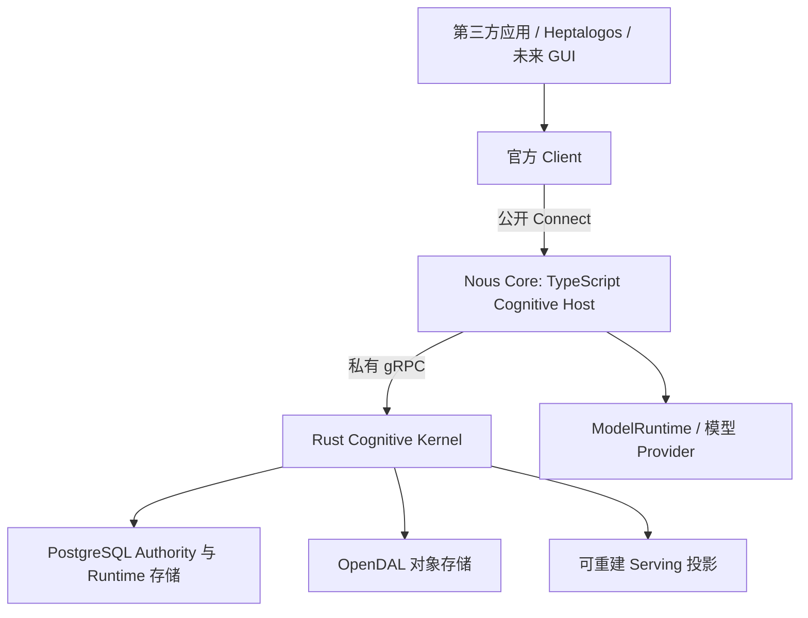

# 产品与架构边界

状态：研究方向已收敛，跨语言架构尚未落地。主要依据 [Pre-Spec](sources/prespec-implementation-research.md) Stage 1、6、7、8 及 [9 月 10 日交接](sources/handoff-2026-09-10.md) §4。早期探索见[运行时设计记录](sources/runtime-projection-design-2026-09-09.md) §19–25。

## 产品与主体

Nous Wave 是独立、通用的长期 Subject cognition 系统。Subject、Agent、Model、Session 和 Consumer 各有职责：同一 Subject 可以由多个 Agent 执行不同工作，也可以使用不同模型和不同上下文投影。

Subject 初始化仍以身份、Character Seed 和基本配置为基础。Character Seed 保留修订与来源；后续 Persona 可以解释、发展甚至偏离 Seed。Memory 是首个可选认知 MicroSystem；Persona、Relationship、Epistemic、Goals 等保留未来边界。

本轮研究保留既有认知语义：Artifact 与 ObservationOccurrence 分离、原始材料与 Memory 分离、来源与修订不可被投影覆盖、读取不自动内化、检索与上下文曝光不自动强化。

## Core + 官方 Client

目标产品包含无界面的 Nous Core 与官方 `@nous-wave/client`。GUI、第三方 Agent 和 Heptalogos 都通过公开 Client/Core 合同使用 Nous。未来 GUI 是管理与呈现消费者，不能直连数据库、Serving 索引或 Kernel 私有协议。



这张图描述目标拓扑。现有 Rust 应用与新名称的对应见[实现差距](STATUS_AND_GAPS.md)。

## 职责划分

| 所有者 | 研究中的责任 |
|---|---|
| TypeScript Cognitive Host | 公开 API、Focus 策略、消费者投影、Context Compiler、Steward、NousQL 解析与绑定、模型调用与能力路由、配置解析 |
| Rust Cognitive Kernel | Subject/Memory Authority、事务与修订校验、材料和证据、检索与排序、Serving、拓扑、producer lineage、Session/Resident/use 持久化、checkpoint CAS |
| 官方 Client | 领域化方法、运输类型封装、取消/deadline、结构化错误、Artifact 字节传输便利接口 |
| 消费应用 | 外部世界事实、行为决策、工具与执行、最终模型调用、对认知结果的实际使用反馈 |

语言边界按职责与变化频率划分。已有 Rust 检索算法、SQL/存储、修订及证据机制继续利用；新进程边界不构成重写这些机制的理由。TypeScript 承接变化频繁的认知编排和模型生态调用。

模型生成是 proposal-first：结构校验后仍须验证 Subject 范围、来源引用、基线修订与操作权限，最后由认知所有者决定是否提交。Kernel 长期不保留另一套外部模型 SDK。

## 进程与协议

研究后续采用独立 Core 监督 Kernel sidecar：

```text
Consumer -> official Client -> Core Host -> Kernel
                            Connect      gRPC / HTTP/2
```

Protobuf 是跨语言协议源，Buf 管理生成；公开命名空间拟为 `nous.wave.v1alpha1`，私有命名空间为 `nous.wave.kernel.v1alpha1`。生成的 transport types 限制在协议适配层，领域逻辑保持明确的类型与语义所有权。

早期方案曾建议 Heptalogos 嵌入 `@nous-wave/host`，或使用 connect-rust 承担 Kernel 边界。Pre-Spec 的后续收敛改为独立 Core + Client，以及公开 Connect、私有标准 gRPC/Tonic。N-API 不用于承载整个 Kernel；不以单一 exe 约束架构。最终安装包与服务分发仍待后续资格验证。

## Nous 与 Heptalogos

这里的“Cognitive Host”指 Nous 内部 TypeScript 层；身份讨论中的“Host-owned Entity/Resource”指外部规范身份的所有者，不能仅因同叫 Host 就将身份所有权转给 Nous Core。

| Nous 的认知责任 | Heptalogos 的应用与行为责任 |
|---|---|
| 长期 cognition、Memory、Focus、认知投影 | MessageFact、Reaction、BehaviorIntent |
| Observation 接收、证据、实际 use 记录 | Review、DecisionCommit、CommunicationCommit、EffectOperation |
| 受控的 Nous cognitive context lane | PromptProgram、最终 InvocationSpec、工具和行为规则 |

共享 SubjectId 只建立关联，不构成共享事务。Subject provisioning 通过查验和协调完成；Heptalogos 不能直接修改 Nous 的 Memory 表，Nous 也不保存 ReactionWorkspace 的中间行为草稿、外部执行不确定性和 Effect 状态。

参考交互为：应用先提交 MessageFact，独立派生 Reaction 和认知 Observation 工作；Observation 使用 `request_id` 重试；Reaction 按可用性获取 CognitiveProjection，组合自己的最终模型调用；行为提交后再报告实际认知使用。

Nous 不可用时，Heptalogos 仍应维持 Basic Subject 行为路径。认知反馈失败不能回滚已提交行为。应用的 Conversation→Session 映射属于消费者策略，不能变成 Nous 的通用不变量。

这些是本批研究对后续跨仓库集成的要求；本次未核验 Heptalogos 当前实现。

## 保留的演进边界

MicroSystem 仍是语义所有者和显式依赖边界。拆分进程并不要求动态插件市场、微服务集群或空的未来认知 crate。

第一轮研究范围包括管理接口，但不包括 GUI 实现、远程多用户权限平台、自动模型基准路由、内部 scheduler、反向 Kernel→Host RPC、通用工作流/任务框架或分布式检索后端。具体原文排除项见 Pre-Spec 后半部 §8.38。
